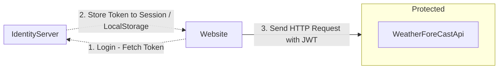

# auth-server
### Project Dependency and Workflow

```mermaid
flowchart LR
    Website -.-> |1. Login - Fetch Token| IdentityServer
    IdentityServer -.-> |2. Store Token to Session / LocalStorage | Website
    Website --> |3. Send HTTP Request with JWT| Protected
    
    subgraph Protected
    WeatherForeCastApi
    end
    subgraph IdentityServer

    end

```

