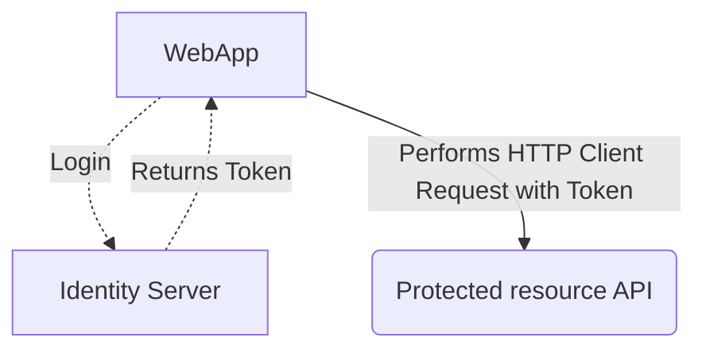

# auth-server


```json
{
  "ConnectionStrings": {
    "DefaultConnection": "Server=localhost;Database=authdb;User Id=sa;Password=someThingComplicated1234;TrustServerCertificate=True;MultiSubnetFailover=True;",
    "DevConnection": "DataSource=app.db;Cache=Shared"
  },
  "Logging": {
    "LogLevel": {
      "Default": "Error",
      "Microsoft": "Warning"
    },
    "Debug": {
      "LogLevel": {
        "Default": "Information",
        "Microsoft.Hosting": "Trace"
      }
    },
    "EventSource": {
      "LogLevel": {
        "Default": "Warning"
      }
    }
  },
  "AllowedHosts": "*",
  "JWT":{
    "ValidAudience":"*",
    "ValidIssuer":"*",
    "Secret":"17CF4AC5-4DC6-4567-BCCE-BB6B668873B3"
  },
  "DefaultPassword": ""
}

```
